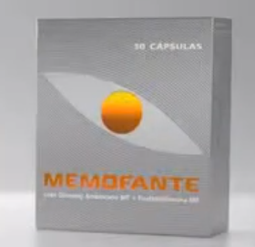

# Memofante
Memofante is here, a biiiig help:
- Do you often forget japanese words you really didn't want to forget?
- Do you have difficulty memorizing vocabulary and kanji readings?

Memofante is a CLI for helping you learn and remember japanese words made in rust 🦀

# How does it work?

This is supposed to be used in conjunction with 
[10ten japanese reader](https://github.com/birchill/10ten-ja-reader) browser extension, 
so you can hover over words in the browser to see the definition.

Memofante works with the concept of ✨**discovered words**✨, 
when you find a new word on the internet that you had to use 10ten japanese reader 
because you didn't know it, you can copy it to memofante and then review the 
words later using **spaced repetition**.

Memofante has 4 basic commands:
- `memofante add <word>`: Adds a new ✨**discovered word**✨
- `memofante list`: Lists your ✨**discovered words**✨ with the successes, failures and success rate in reviews
- `memofante remove <word>`: Remove a ✨**discovered word**✨
- `memofante review`: Starts a new review

## How the reviews work?

Memofante will ask the meaning or the reading of all the ✨**discovered word**✨, 
the order and frequency of which they appear will be sorted by the success rate, 
if you ever used something like duolingo before this will feel familiar.
# Why the name "Memofante"?
It's a reference to a medication that was around in 2014-2016 in portugal to improve memory for people +50 years old, which had a really funny comercial:

